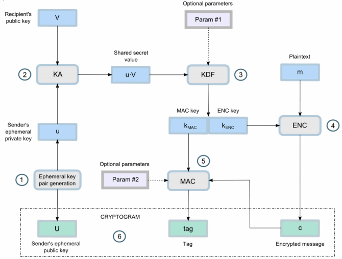

# Elliptic Curve Cryptography and Elliptic Curve Diffle-Hellman Key Exchange Algorithms


**Course: Theory of Cryptography - ET3310**

**Lecturers: Do Trong Tuan, Ma Viet Duc**

**School: Hanoi University of Science and Technology - HUST**

**Group: 4**

**Students: Nguyen Ho Trieu Duong - C41 , Nguyen Tien Dat - C42, Vu Tien Dat - C43**

**Created: Tue 16 Dec 2025 08:25:39 Hanoi, Vietnam**


*Mục tiêu của báo cáo này là lập trình và thử nghiệm ứng dụng hệ mật Elliptic Curve Cryptography (ECC), qua đó nâng cao thành phương pháp mã hóa tiêu chuẩn ECIES (Elliptic Curve Integrated Encryption Scheme), thường được dùng trong các giao thức bảo mật như SSL/TLS (HTTPS) và TLS (Transport Layer Security). Cuối cùng, nhóm thử xây dựng phương pháp trao đổi khóa ECDH (Elliptic Curve Diffie–Hellman Key Exchange). Điều này cho phép hai bên, mỗi bên sở hữu một cặp khóa công khai-riêng tư dạng đường cong elliptic, thiết lập một bí mật chung qua một kênh không an toàn.*


## 1. Xây dựng hệ mật Elliptic Encryption Cryptography (ECC)

### 1.1 Elliptic Curve Cryptography (ECC)

Mật mã đường cong Elliptic (ECC) là một họ hệ thống mật mã khóa công khai hiện đại, dựa trên cấu trúc đại số của các đường cong elliptic trên trường hữu hạn và độ khó của Bài toán Logarit rời rạc đường cong Elliptic (Elliptic Curve Discrete Logarithm Problem - ECDLP).

ECC thực hiện tất cả các khả năng chính của hệ thống mật mã bất đối xứng: mã hóa, chữ ký và trao đổi khóa.

Mật mã ECC được coi là sự kế thừa hiện đại tự nhiên của hệ thống mật mã RSA, bởi vì ECC sử dụng khóa và chữ ký nhỏ hơn RSA với cùng mức độ bảo mật và cung cấp khả năng tạo khóa rất nhanh, thỏa thuận khóa nhanh và chữ ký nhanh.

#### Elliptic Curves: 

Đường cong elliptic trên trường hữu hạn có dạng

$$ E: y^2 \equiv x^3 + ax + b \pmod{p} $$

trong đó:

𝑎,𝑏: hằng số với điều kiện đường cong không suy biến 

$$ 4a^3 + 27b^2 \not\equiv 0 \pmod{p} $$

𝑝: số nguyên tố lớn


```Python
class EllipticCurve:
    def __init__(self, a, b, p):
        self.a = a
        self.b = b
        self.p = p

        if (4 * a**3 + 27 * b**2) % p == 0:
            raise ValueError("Đường cong suy biến")
```


#### EC points: 
Điểm nằm trên đường cong là một cặp số nguyên tọa độ {x,y} nằm trên đường cong thỏa mãn phương trình của đường cong elliptic $E$ trên trường hữu hạn $\mathbb{F}_p$. 

Tập hợp tất cả các điểm trên $E$, bao gồm cả điểm vô cực $\mathcal{O}$, ký hiệu là $E(\mathbb{F}_p)$, tạo thành một nhóm Abel dưới phép toán cộng điểm (point addition).

```Python
class Point:
    def __init__(self, curve, x, y):
        self.curve = curve
        self.x = x
        self.y = y

    def is_infinity(self):
        return self.x is None and self.y is None

    def __eq__(self, other):
        return self.x == other.x and self.y == other.y
    def __str__(self):
        if self.is_infinity():
            return "O (Point at Infinity)"
        return f"({self.x}, {self.y})"
```


#### Khóa công khai, khóa bí mật và điểm sinh trong ECC: 
Trong ECC, chúng ta có các thành phần chính sau:

- Đường cong Elliptic (EC) trên trường hữu hạn $\mathbb{F}_p$ (với $p$ là số nguyên tố lớn), được định nghĩa bởi phương trình Weierstrass:

$$ E: y^2 \equiv x^3 + ax + b \pmod{p} $$


Với điều kiện không suy biến (non-singular):

$$ 4a^3 + 27b^2 \not\equiv 0 \pmod{p} $$

- Điểm sinh (Generator point / Base point): Một điểm cố định

$$ G \in E(\mathbb{F}_p) $$

có bậc nguyên tố $n$ (tức là $n$ nhỏ nhất sao cho $nG = \mathcal{O}$, với $\mathcal{O}$ là điểm vô cực – phần tử đơn vị của nhóm).

- Khóa bí mật (Private key): Một số nguyên (scalar)
$$ k \in \{1, 2, \dots, n-1\} $$

- Khóa công khai (Public key): Điểm trên đường cong được tính bằng phép nhân vô hướng
$$ P = kG $$


#### Phép cộng hai điểm khác nhau trên đường cong elliptic

Giả sử hai điểm khác nhau $P(x_1, y_1)$ và $Q(x_2, y_2)$ nằm trên đường cong
$ E: y^2 \equiv x^3 + ax + b \pmod{p} $:

Kết quả của phép cộng $R = P + Q = (x_3, y_3)$ được tính như sau:

- Tính hệ số đường thẳng đi qua P và Q:

$$ \lambda = \frac{y_2 - y_1}{x_2 - x_1} \pmod{p} $$

(Chú ý ở đây cần tính nghịch đảo modulo của $(x_2 - x_1)$ nhân với $(y_2 - y_1)$.)

```Python 
def modinv(a, p):
    if a == 0:
        raise ZeroDivisionError("Không có nghịch đảo modulo")

    lm, hm = 1, 0
    low, high = a % p, p

    while low > 1:
        r = high // low
        nm = hm - lm * r
        new = high - low * r
        hm, lm = lm, nm
        high, low = low, new

    return lm % p
```

- Tính tọa độ x của điểm kết quả: 

$$ x_3 = \lambda^2 - x_1 - x_2 \pmod{p} $$

- Tính tọa độ $y$ của điểm kết quả:
$$ y_3 = \lambda (x_1 - x_3) - y_1 \pmod{p} $$


Khi cộng một điểm với chính nó, tức là tính $R = 2P = P + P$, kết quả $R = (x_3, y_3)$ được tính như sau:

- Tính hệ số tiếp tuyến tại $P$:
$$ \lambda = \frac{3x_1^2 + a}{2y_1} \pmod{p} $$

- Tính tọa độ $x$ của điểm kết quả:
$$ x_3 = \lambda^2 - 2x_1 \pmod{p} $$
- Tính tọa độ $y$ của điểm kết quả:
$$ y_3 = \lambda (x_1 - x_3) - y_1 \pmod{p} $$


```Python
def point_add(P, Q):
    curve = P.curve

    # Trường hợp O
    if P.is_infinity():
        return Q
    if Q.is_infinity():
        return P

    # P + (-P) = O
    if P.x == Q.x and (P.y + Q.y) % curve.p == 0:
        return Point(curve, None, None)

    if P != Q:
        # lambda = (y2 - y1)/(x2 - x1)
        l = ((Q.y - P.y) * modinv(Q.x - P.x, curve.p)) % curve.p
    else:
        # Nhân đôi
        l = ((3 * P.x**2 + curve.a) * modinv(2 * P.y, curve.p)) % curve.p

    x3 = (l**2 - P.x - Q.x) % curve.p
    y3 = (l * (P.x - x3) - P.y) % curve.p

    return Point(curve, x3, y3)
```


#### Phép nhân vô hướng

Phép nhân vô hướng được định nghĩa là việc cộng điểm $  P  $ với chính nó $  k  $ lần:
$   kP = P + P + \cdots + P \quad (k \text{ lần})   $
Kết quả là một điểm khác trên đường cong, vẫn thuộc nhóm $  E(\mathbb{F}_p)  $.


```Python
def scalar_mult(k, P):
    result = Point(P.curve, None, None)  # O
    addend = P

    while k:
        if k & 1:
            result = point_add(result, addend)
        addend = point_add(addend, addend)
        k >>= 1

    return result

```

### 1.2. Mã hóa / Giải mã hóa ECC

Hệ mã hóa/giải mã yêu cầu một điểm sinh $G$ và nhóm đường cong elliptic $E_q(a, b)$ làm tham số. Mỗi người dùng A chọn khóa bí mật là số nguyên $n_A$ và tạo khóa công khai $P_A = n_A \times G$.

- Để mã hóa và gửi thông điệp $P_m$ đến B, A chọn một số nguyên dương ngẫu nhiên $k$ và tạo bản mã $C_m$ gồm cặp điểm:

$$ C_m = \{kG, P_m + kP_B\} $$
(Lưu ý rằng A đã sử dụng khóa công khai $P_B$ của B)

```Python
def encrypt(curve, G, public_key, message_point, n):
    k = random.randint(1, n - 1)
    C1 = scalar_mult(k, G)
    C2 = point_add(message_point, scalar_mult(k, public_key))
    return C1, C2
```

- Để giải mã bản mã, B nhân điểm đầu tiên trong cặp với khóa bí mật của B và trừ kết quả khỏi điểm thứ hai:

$$ P_m + kP_B - n_B(kG) = P_m + k(n_B G) - n_B(kG) = P_m $$

```Python
def decrypt(private_key, C1, C2):
    return point_add(C2, scalar_mult(private_key, Point(C1.curve, C1.x, -C1.y)))
```

Sau đây là một ví dụ đơn giản 

```Python
curve = EllipticCurve(-1,188,751)
G = Point(curve,0,376)
Message = Point(curve,562, 201)
k = 386 
private_b = 58 
public_b = scalar_mul(private_b,G)
C1, C2 = encrypt(curve,G, public_b,Message, k)
print("Message: ",Message)
print("Ciphertext =",C1, C2 )
plain= decrypt(private_b, C1, C2)
print("After decrypt: ", plain)
=================================

Message:  (562, 201)
Ciphertext = (676, 558) (385, 328)
After decrypt:  (562, 201)
```
## 2. Phương pháp trao đổi khóa ECDH (Elliptic Curve Diffie–Hellman Key Exchange)

Elliptic Curve Diffie–Hellman Key Exchange (ECDH) là một giao thức trao đổi khóa ẩn danh (anonymous key agreement), cho phép hai bên (Alice và Bob) – mỗi bên có cặp khóa công khai - bí mật dựa trên đường cong elliptic – thiết lập một *khóa bí mật chung (shared secret key)* qua kênh truyền không an toàn.


ECDH rất giống với thuật toán Diffie–Hellman cổ điển (DHKE), nhưng thay vì dùng lũy thừa modulo, nó sử dụng phép nhân vô hướng điểm trên đường cong elliptic (ECC point multiplication). ECDH dựa trên tính chất kết hợp trong nhóm Abel của các điểm EC:

$$ (a \cdot G) \cdot b = (b \cdot G) \cdot a $$

Nếu có hai số bí mật $a$ và $b$ (là khóa bí mật của Alice và Bob) và đường cong elliptic với điểm sinh $G$, ta có thể trao đổi công khai qua kênh không an toàn các giá trị $(a \cdot G)$ và $(b \cdot G)$ (là khóa công khai của Alice và Bob), rồi suy ra khóa bí mật chung:

$$ \text{shared secret key} = (a \cdot G) \cdot b = (b \cdot G) \cdot a $$

Thuật toán ECDH có quy trình thực hiện như sau:


- Alice tạo ngẫu nhiên cặp khóa ECC: $alicePrivKey$, $alicePubKey = alicePrivKey \cdot G$

- Bob tạo ngẫu nhiên cặp khóa ECC: $bobPrivKey, bobPubKey = bobPrivKey \cdot G$
- Alice và Bob trao đổi khóa công khai qua kênh không an toàn (ví dụ: qua Internet).

- Alice tính toán khóa bí mật chung: $sharedKey = bobPubKey \cdot alicePrivKey$
- Tương tự, Bob cũng tính toán khóa bí mật chung: $sharedKey = alicePubKey \cdot bobPrivKey$

- Bây giờ cả Alice và Bob đều có cùng sharedKey. Không ai khác (kể cả kẻ nghe lén trên mạng) có thể tính ra được điểm này, vì họ chỉ thấy được khóa công khai (alicePubKey và bobPubKey), không thấy khóa bí mật.


```Python
from tinyec import registry #thư viện dùng cho elliptic arithmetic
import secrets
#Compress khóa công khai thành dạng chuỗi hex ngắn gọn
def compress(pubKey):
    return hex(pubKey.x) + hex(pubKey.y % 2)[2:]
# Đường cong elliptic chuẩn brainpoolP256r1
curve = registry.get_curve('brainpoolP256r1')

alicePrivKey = secrets.randbelow(curve.field.n)
alicePubKey = alicePrivKey * curve.g
print("Alice public key:", compress(alicePubKey))

bobPrivKey = secrets.randbelow(curve.field.n)
bobPubKey = bobPrivKey * curve.g
print("Bob public key:", compress(bobPubKey))
# Truyền đi trên kênh không bảo mật (kẻ tấn công cũng có thể nhìn thấy)
print("Now exchange the public keys (e.g. through Internet)")

aliceSharedKey = alicePrivKey * bobPubKey
print("Alice shared key:", compress(aliceSharedKey))

bobSharedKey = bobPrivKey * alicePubKey
print("Bob shared key:", compress(bobSharedKey))
Kiểm tra 
print("Equal shared keys:", aliceSharedKey == bobSharedKey)


====================================================================
Alice public key: 0x8980de81ebbc4bee70dcc46beedca323fe3933f05696e64b787504572398790c0
Bob public key: 0x19a8279bac8b52df0ce4e82180e5d6c3681b97d311e15af06f4ddf965d5768031
Now exchange the public keys (e.g. through Internet)
Alice shared key: 0x9b2cc2e54fcdfa2b4de88ceadd4acdfd775397264a3ca3f70415e7f3b12538510
Bob shared key: 0x9b2cc2e54fcdfa2b4de88ceadd4acdfd775397264a3ca3f70415e7f3b12538510
Equal shared keys: True
```

## 3. Giao thức mã hóa ECIES (Elliptic Curve Integrated Encryption Scheme)
Elliptic Curve Integrated Encryption Scheme (ECIES) được sử dụng trong nhiều mật mã như SECG SEC-1, ISO/IEC 18033-2, IEEE 1363a và ANSI X9.63. ECIES là môttj giao thức mã hóa xác thực bằng khóa công khai nhưng sử dụng hàm KDF (key-derivation function) để dẫn xuất khóa MAC riêng biệt và khóa mã hóa đỗi xứng từ khóa bí mật chung của ECDH.

Tiêu chuẩn ECIES kết hợp mật mã bất đối xứng dựa trên ECC với các thuật toán mã hóa đối xứng để cung cấp mã hóa dữ liệu bằng khóa riêng EC và giải mã bằng khóa công khai EC tương ứng.

Tiêu chuẩn sử dụng *mật mã ECC (hệ mật mã khóa công khai)* kết hợp hàm dẫn xuất khóa (KDF) cùng với *thuật toán mã hóa đối xứng* và thuật toán MAC như hình dưới đây.



- Đầu vào của quá trình mã hóa ECIES bao gồm khóa công khai của người nhận và tin nhắn văn bản gốc. Đầu ra bao gồm khóa công khai tạm thời của người gửi (khóa công khai đã được mã hóa bằng ECC), tin nhắn đã được mã hóa (ciphertext+tham số thuật toán đối xứng) và mã MAC đóng vai trò thẻ xác thực.

```Python
ECIES-encrypt(recipientPublicKey, plaintextMessage) ➔ {cipherTextPublicKey, encryptedMessage, authTag}
```


- Quá trình giải mã ECIES lấy đầu ra từ quá trình mã hóa kết hợp với khóa riêng của người nhận và trả về bản tin nhắn văn bản gốc hoặc phát hiện sự cố nếu có (lỗi toàn vẹn/xác thực).

```Python
ECIES-decrypt(cipherTextPublicKey, encryptedMessage, authTag, recipientPrivateKey,) ➔ plaintextMessage

```
Trong thư mục có 1 ví dụ cơ bản về ECIES Ecryption và Decryption sử dụng hệ mật mã bất đối xứng đường cong **SECP256K1** kết hợp với hệ mật đối xứng**AES-GCM** với kết quả như sau:

- Hàm mã hóa sử dụng giao thức mã hóa ECIES và khóa công khai 256 bit ECC. Đầu vào bao gồm khóa công khai ở dạng hex (ở dòng đầu tiên, chưa nén, 128 chữ số hex) + thông điệp văn bản gốc để mã hóa (ở dòng thứ hai). Đầu ra là thông điệp đã được mã hóa ở dạng thập lục phân. Nó chứa khóa công khai của bản mã ECC + bản mã + các tham số của thuật toán khóa đối xứng.
- Hàm giải mã thông điệp đã mã hóa được tạo ra bởi chương trình ở trên, sử dụng giao thức ECIES và khóa riêng ECC 256 bit. Đầu vào bao gồm khóa riêng dạng hex và thông điệp đã mã hóa (có sẵn ở trên). Ta thu được đầu ra là thông điệp văn bản gốc đã được giải mã. Trong trường hợp có sự cố giải mã, ta báo lỗi.

```
Receiver's public key:
552e2b308514b38e4989d71ed263e0af6376f65ba81a94ebb74f6fadc223ee80aa8fb710cfb445e0871cd1c1a0c1f2adb2b6eedc2a0470b04244548c5be518c8

PLaintext:
Sample text for ECIES encryption.

Encrypted Message:
04428c396e29eca80a12fd694c62d589fb23acb4509c25ab2aab7d584b8c4815e9213d236cef9d4abb7709cdcf84d19f4b0ccc4cce42d0182183742f3cc7199af24066074173133e262d1054220cd4fffef43a863f5508a98f843d8fd7d00352aabb4df41a621aed10862dd2fa2aec7c93f91d1023712d66f1561d10c8c8

Receiver's private key:
27f07d3251dee39ec2c5ff800641f4d839e6f8065033e9a710ea2e519473bdd7

Plaintext after decrypt:
Sample text for ECIES encryption.
```

## 4. So sánh RSA và ECC 

Rất khó để so sánh rằng ECC hay RSA tốt hơn trong lĩnh vực hệ thống mật mã khóa công khai, do đó ta sẽ trình bày những điểm mạnh và điểm yếu của chúng. Cả hai hệ thống mật mã (RSA và mật mã đường cong elliptic) đều hoạt động với khóa riêng và khóa công khai, cung cấp các khả năng tương tự như tạo khóa, chữ ký số, các lược đồ thỏa thuận khóa và các lược đồ mã hóa.

Mã hóa đường cong Elliptic (ECC) có những ưu điểm sau so với RSA:

- Khóa, bản mã và chữ ký nhỏ hơn. Thông thường, đối với mã hóa 128 bit, khóa riêng EC 256 bit được sử dụng. Chữ ký thường có độ dài gấp 2 lần hoặc dài hơn độ dài khóa riêng (tùy thuộc vào lược đồ mã hóa). Ngược lại, trong RSA, đối với bảo mật 128 bit, cần khóa riêng 3072 bit. Độ dài bản mã thường bằng độ dài của văn bản gốc chưa mã hóa.

- Tạo khóa rất nhanh. Trong các hệ mật mã ECC, việc tạo khóa bao gồm tạo số ngẫu nhiên + phép nhân điểm EC và cực kỳ nhanh, ngay cả đối với các đường cong phức tạp nhất được sử dụng trong thực tế. Ngược lại, trong RSA, việc tạo khóa có thể chậm, đặc biệt đối với các khóa dài (ví dụ: khóa 4096 bit trở lên), do quá trình tạo số nguyên tố.

- Chữ ký nhanh. Ký tin nhắn và xác minh chữ ký ECC rất nhanh: chỉ cần một vài phép tính điểm EC.

- Thỏa thuận khóa chung nhanh. Thỏa thuận khóa (ECDH) đơn giản như nhân một điểm EC với một số nguyên và rất nhanh. Mã hóa và giải mã nhanh chóng. Trên thực tế, quá trình mã hóa nhanh như mã hóa khóa đối xứng cơ bản (nhờ lược đồ mã hóa ECIES) cộng với sự chậm lại nhỏ từ thỏa thuận khóa ECDH.


Tuy vậy, mã hóa đường cong Elliptic (ECC) có một số nhược điểm như sau:

- ECC phức tạp và khó triển khai một cách an toàn hơn so với RSA. Điều này không nhất thiết là vấn đề nếu bạn sử dụng các thư viện mã hóa đã được kiểm chứng từ các nhà cung cấp đáng tin cậy. Tuy nhiên nếu bạn muốn xây dựng từ đầu (from-scratch) thì cần phải hiểu rõ mô hình toán học của đường cong elliptic.

- Không phải tất cả các đường cong tiêu chuẩn đều được coi là an toàn. Bạn nên biết cách chọn một đường cong mạnh cho các phép tính ECC của mình.


Xét đến hệ mật RSA, nó có những điểm mạnh sau:

- RSA dễ triển khai hơn ECC. Trừ khi bạn tự triển khai các thuật toán, điều này có thể không quá quan trọng.
- RSA dễ hiểu hơn ECC: Việc ký và giải mã tương tự nhau; mã hóa và xác minh cũng tương tự nhau. Điều này giúp đơn giản hóa việc hiểu thuật toán, quan trọng hơn nếu bạn tự triển khai các thuật toán thay vì sử dụng một thư viện có sẵn.

Một số hạn chế của hệ thốn RSA:

- Trong hệ mã hóa RSA, việc tạo khóa rất chậm (đặc biệt là với độ dài khóa lớn). Trên một máy tính xách tay hiện đại, việc tạo một cặp khóa RSA 16384 bit có thể mất vài phút.

- RSA tạo ra các chữ ký lớn (có cùng độ dài với khóa riêng). Điều này không thể chấp nhận được đối với nhiều hệ thống lưu trữ nhiều chữ ký, ví dụ như các chuỗi khối công khai (blockchains).
